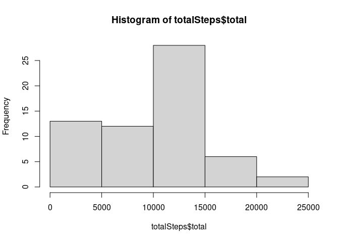
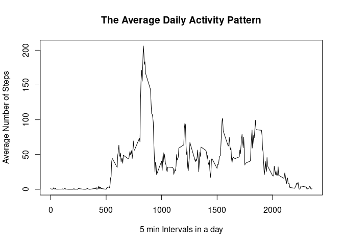

```r
library(tidyverse)
```

```
## ── Attaching packages ─────────────────────────────────────── tidyverse 1.3.2 ──
## ✔ ggplot2 3.4.0      ✔ purrr   0.3.5 
## ✔ tibble  3.1.8      ✔ dplyr   1.0.10
## ✔ tidyr   1.2.1      ✔ stringr 1.4.1 
## ✔ readr   2.1.3      ✔ forcats 0.5.2 
## ── Conflicts ────────────────────────────────────────── tidyverse_conflicts() ──
## ✖ dplyr::filter() masks stats::filter()
## ✖ dplyr::lag()    masks stats::lag()
```

```r
library(lattice)
```


## Loading and preprocessing the data

```r
unzip("activity.zip", junkpaths = TRUE)
activityData <- read.csv("activity.csv")

activityData$date <- as.Date(activityData$date)

head(activityData)
```

```
##   steps       date interval
## 1    NA 2012-10-01        0
## 2    NA 2012-10-01        5
## 3    NA 2012-10-01       10
## 4    NA 2012-10-01       15
## 5    NA 2012-10-01       20
## 6    NA 2012-10-01       25
```


## What is mean total number of steps taken per day?

```r
# Calculate the total number of steps taken per day
totalSteps <- activityData %>%
    group_by(date) %>%
    summarise(total = sum(steps, na.rm = TRUE))
# Histogram of the total number of steps taken each day
hist(totalSteps$total)
```

<!-- -->

```r
# Mean & Median of the total number of steps taken per day
meanSteps <- mean(totalSteps$total, na.rm = TRUE)
medianSteps <- median(totalSteps$total, na.rm = TRUE)

meanSteps
```

```
## [1] 9354.23
```

```r
medianSteps
```

```
## [1] 10395
```


## What is the average daily activity pattern?

```r
avgDailyActivity <- activityData %>%
    group_by(interval) %>%
    summarize(average_steps = mean(steps, na.rm = TRUE))

with(avgDailyActivity, plot(x = interval, y = average_steps, type = "l",
                                xlab = "5 min Intervals in a day",
                                ylab = "Average Number of Steps", 
                                main = "The Average Daily Activity Pattern"))
```

<!-- -->


```r
# 5-minute interval which contains maximum average number of steps
maxInterval = avgDailyActivity$interval[which.max(avgDailyActivity$average_steps)]
maxInterval
```

```
## [1] 835
```

## Imputing missing values


```r
# Calculate the missing values in the dataset
sum(is.na(activityData))
```

```
## [1] 2304
```


```r
activityData_new <- merge(avgDailyActivity, activityData, by = "interval")
naSteps <- is.na(activityData_new$steps)
activityData_new$steps[naSteps] <- activityData_new$average_steps[naSteps]
activityData_new <- activityData_new[,-(2)]
```


```r
totalStepsNew <- activityData_new %>%
    group_by(date) %>%
    summarise(total_steps = sum(steps))
# Histogram of the total number of steps taken each day
with(totalStepsNew, hist(total_steps))
```

<!-- -->


```r
mean_totalStepsNew <- mean(totalStepsNew$total_steps)
median_totalStepsNew <- median(totalStepsNew$total_steps)

mean_totalStepsNew
```

```
## [1] 10766.19
```

```r
median_totalStepsNew
```

```
## [1] 10766.19
```


## Are there differences in activity patterns between weekdays and weekends?


```r
# Creating a new factor variable with two levels - weekday and weekend
activityData_new$day <- "weekday"
activityData_new$day[weekdays(as.Date(activityData_new$date), abb=TRUE) %in% c("Sat","Sun")] <- "weekend"

activityData_new$day <- as.factor(activityData_new$day)
```


```r
# Make a time series panel plot of the 5-minute interval and the average number of steps taken on weekday and weekend
avgDailyActivity_new <- aggregate(steps ~ interval + day, data = activityData_new, FUN="mean")
```


```r
xyplot(steps ~ interval | day, data = avgDailyActivity_new,
       type = "l", layout = c(1,2),
       main = "Average  5-min. activity intervals: Weekdays vs. Weekends",
       xlab = "5-min Interval",
       ylab = "Average Steps")
```

<!-- -->

